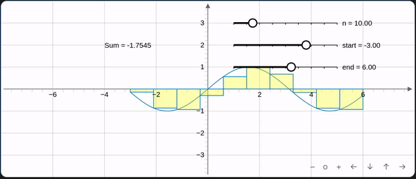

# Graphs 

Plugin of [Obsidian](https://obsidian.md/) that creates interactive graphs from YAML.

This file only covers the basics of how to use this plugin for more information go to [Graphs Wiki](https://github.com/DylanHojnoski/obsidian-graphs/wiki).

## Installation

Can be found in the community plugin browser in Obsidian.
* make sure to turn off restricted mode
* you can paste this link into your browser and it will bring you to the page
	* `obsidian://show-plugin?id=graphs`
 *  click install

## How to use 

To create a graph create a code block with the language set to graph.

````
```graph
bounds: [Xmin, Ymax, Xmax, Ymin]
elements: [
	{type: "name", def: []}
]
```
````

### Examples

#### Line

````
```graph
bounds: [-10, 10, 10, -10]
elements: [
	{type: "line", def: [[0,0],[4,1]]}
]
```
````


#### Sin Riemannsum

````
```graph
bounds: [-8,4,8,-4]
elements: [
	{type: "slider", def: [[1,3],[5,3],[1,10,50]], att: {name: "n"}},
	{type: "slider", def: [[1,2],[5,2],[-10,-3,0]], att: {name: "start"}},
	{type: "slider", def: [[1,1],[5,1],[1,6,10]], att: {name: "end"}},
	{type: "functiongraph", def: ["f:Math.sin(x)", "f:e1", "f:e2"]},
	{type: "riemannsum", def: ["f:Math.sin(x)","f:e0", "left", "f:e1", "f:e2"], att: {fillColor: "#ffff00", fillOpacity: 0.3}},
	{type: "text", def: [-4, 2, "'Sum = ' + f:e4.toFixed(4)"], att: {fillColor: "#ffff00", fillOpacity: 0.3}},
]

```
````



## Bugs

If you find any bugs with this plugin please create a new issue so that they can be resolved.

##  Contributing

If you want to contribute please create an issue or pull request.


## Attribution

This plugin uses 

- [JSXGraph](https://jsxgraph.org/wp/index.html)

