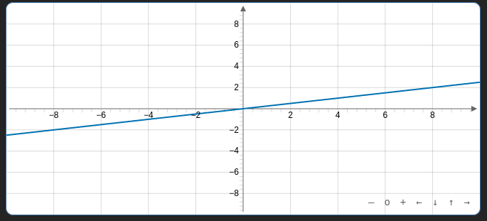

# Graphs 

Plugin of [Obsidian](https://obsidian.md/) that creates interactive graphs from YAML.

This file only covers the basics of how to use this plugin for more information go to [Graphs Wiki](https://github.com/DylanHojnoski/obsidian-graphs/wiki).

## How to use 

To create a graph create a code block with the language set to graph.

````
```graph
bounds: [Xmin, Ymax, Xmax, Ymin]
elements: [
	{type: "name", def: []}
]
```
````

### Example

````
```graph
bounds: [-10, 10, 10, -10]
elements: [
	{type: "line", def: [[0,0],[4,1]]}
]
```
````



## Bugs

If you find any bugs with this plugin please create a new issue so that they can be resolved.

##  Contributing

If you want to contribute please create an issue or pull request.


## Attribution

This plugin uses 

- [JSXGraph](https://jsxgraph.org/wp/index.html)

